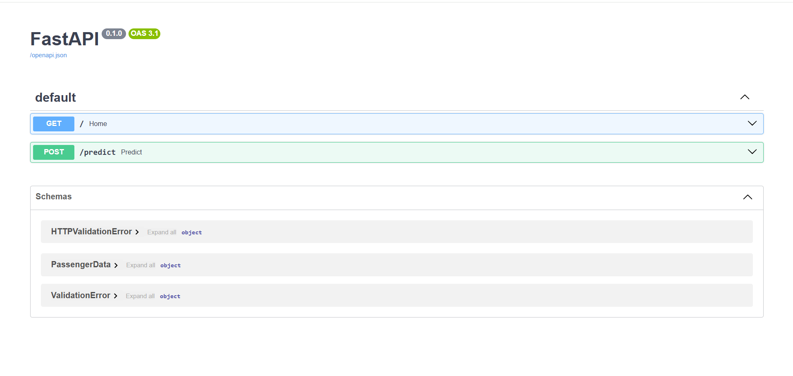

# ML Model Deployment System (FastAPI)

## Overview

This project demonstrates how to deploy a machine learning model as a REST API using FastAPI.

The system trains a machine learning model using the Titanic dataset and exposes a prediction API endpoint that allows users to send passenger data and receive survival predictions.

This project simulates a real-world ML deployment workflow including:

- Data preprocessing
- Model training
- Model serialization
- API development
- Prediction endpoint
- Local deployment using FastAPI

---

## API Demo

FastAPI automatically generates interactive documentation that allows users to test the model directly from the browser.

The interface allows sending passenger data and receiving real-time predictions from the trained machine learning model.

---

## Project Structure

ml-model-deployment-system-khatantamir

├── api  
│   └── main.py  
│  
├── data  
│   └── titanic.csv  
│  
├── models  
│   └── model.pkl  
│  
├── notebooks  
│  
├── src  
│   ├── train.py  
│   └── predict.py  
│  
├── images  
│   └── api-demo.png  
│  
├── Dockerfile  
├── requirements.txt  
└── README.md  

---

## Machine Learning Pipeline

The machine learning workflow includes the following steps:

1. Load the Titanic dataset  
2. Select relevant features  
3. Train a classification model  
4. Evaluate model performance  
5. Save the trained model using joblib  

The trained model is saved as:

models/model.pkl

This serialized model is later used by the API to generate predictions.

---

## Features Used in the Model

The model uses the following passenger attributes:

Feature | Description  
Pclass | Passenger ticket class  
Sex | Passenger gender  
Age | Passenger age  
SibSp | Number of siblings/spouses aboard  
Parch | Number of parents/children aboard  
Fare | Passenger fare  

These inputs are used by the model to predict survival probability.

---

## Model Training

To train the model run:

python src/train.py

After training the model will be saved to:

models/model.pkl

Example output:

Model accuracy: 0.81  
Model saved to models/model.pkl  

---

## Running the API

Start the FastAPI server with:

python -m uvicorn api.main:app --reload

If the server starts successfully you will see:

Uvicorn running on http://127.0.0.1:8000

---

## API Documentation

FastAPI automatically generates interactive API documentation.

Open the following URL in your browser:

http://127.0.0.1:8000/docs

This interface allows users to test the API directly from the browser.

---

## Prediction Endpoint

Endpoint:

POST /predict

Example request:

{
"Pclass": 3,
"Sex": 1,
"Age": 22,
"SibSp": 1,
"Parch": 0,
"Fare": 7.25
}

Example response:

{
"prediction": "Did not survive"
}

The API loads the trained model and returns a prediction based on the input passenger data.

---

## Requirements

Install required libraries using:

pip install -r requirements.txt

Main libraries used:

- pandas
- scikit-learn
- fastapi
- uvicorn
- joblib

---

## Docker Deployment

This project also includes a Dockerfile for containerized deployment.

Build the Docker image:

docker build -t ml-model-api .

Run the container:

docker run -p 8000:8000 ml-model-api

Then open:

http://localhost:8000/docs

---

## Technologies Used

- Python
- Pandas
- Scikit-learn
- FastAPI
- Uvicorn
- Joblib
- Docker

---

## Project Purpose

This project demonstrates how machine learning models can be moved from development into production environments by exposing them through an API.

It highlights important ML engineering practices including:

- Model serialization
- API integration
- Reproducible environments
- Deployment-ready architecture

---

## Author

Khatantamir Otgonbyamba

GitHub:
https://github.com/Khatantamir

---

## License

This project is intended for educational and portfolio purposes.
